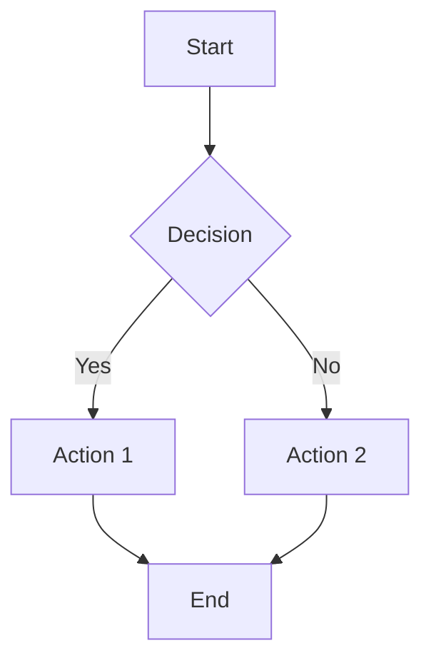

# IntelliTutor - AI-Powered Educational Tutoring System

An intelligent tutoring platform that uses **RAG (Retrieval Augmented Generation)** to provide personalized, context-aware educational support to students.

## Table of Contents

- [Overview](#overview)
- [Architecture](#architecture)
- [Data Flow](#data-flow)
- [Quick Start](#quick-start)
- [Development Setup](#development-setup)
- [Production Deployment](#production-deployment)
- [API Documentation](#api-documentation)
- [Configuration](#configuration)
- [Demo Credentials](#demo-credentials)

---

## Overview

IntelliTutor combines:
- **Flask** web backend with secure authentication
- **CrewAI** for multi-agent orchestration
- **Qdrant** vector database for semantic search
- **PostgreSQL** for relational data storage
- **Ollama** for local LLM inference (or OpenAI-compatible APIs)

### Key Features

- Personalized tutoring based on student profiles
- RAG-powered responses grounded in course materials
- Multi-subject support with content isolation
- Real-time streaming responses with SSE
- **Markdown rendering** with syntax-highlighted code blocks
- **LaTeX/math rendering** for mathematical expressions
- **Mermaid diagrams** for flowcharts, sequence diagrams, and more
- Real-time metrics and observability
- Secure password hashing and session management
- Hot reload for development

---

## Architecture

```
┌─────────────────────────────────────────────────────────────────────────────────┐
│                              INTELLITUTOR ARCHITECTURE                          │
└─────────────────────────────────────────────────────────────────────────────────┘

┌─────────────────────────────────────────────────────────────────────────────────┐
│                                 PRESENTATION LAYER                               │
├─────────────────────┬─────────────────────┬─────────────────────────────────────┤
│   Flask Web UI      │   Streamlit UI      │        Gradio Chatbot               │
│   (port 5000)       │   (port 8501)       │        (port 7860)                  │
│   ┌───────────┐     │   ┌───────────┐     │   ┌───────────────────┐             │
│   │ login     │     │   │ Login     │     │   │ Simple Chat       │             │
│   │ dashboard │     │   │ Profile   │     │   │ Interface         │             │
│   │ chat      │     │   │ Chat      │     │   └───────────────────┘             │
│   │ admin     │     │   └───────────┘     │                                     │
│   └───────────┘     │                     │                                     │
└─────────────────────┴─────────────────────┴─────────────────────────────────────┘
                                    │
                                    ▼
┌─────────────────────────────────────────────────────────────────────────────────┐
│                              APPLICATION LAYER                                   │
├─────────────────────────────────────────────────────────────────────────────────┤
│                                                                                  │
│  ┌──────────────────────────────────────────────────────────────────────────┐   │
│  │                        auth_app.py (Flask)                                │   │
│  │  ┌─────────────┐  ┌─────────────┐  ┌─────────────┐  ┌─────────────────┐  │   │
│  │  │ /login      │  │ /dashboard  │  │ /api/chat   │  │ /admin          │  │   │
│  │  │ /logout     │  │ /chat/<id>  │  │ /api/user   │  │ (settings)      │  │   │
│  │  └─────────────┘  └─────────────┘  └─────────────┘  └─────────────────┘  │   │
│  └──────────────────────────────────────────────────────────────────────────┘   │
│                                    │                                             │
│                                    ▼                                             │
│  ┌──────────────────────────────────────────────────────────────────────────┐   │
│  │                        agents_rag.py (CrewAI)                             │   │
│  │  ┌────────────────────────┐    ┌─────────────────────────────────────┐   │   │
│  │  │  StudentProfileAgent   │───▶│          TutorAgent                  │   │   │
│  │  │  - get_subject_ids()   │    │  - answer_question()                 │   │   │
│  │  │  - get_profile()       │    │  - RAG orchestration                 │   │   │
│  │  └────────────────────────┘    │  - LLM invocation                    │   │   │
│  │                                 └─────────────────────────────────────┘   │   │
│  └──────────────────────────────────────────────────────────────────────────┘   │
└─────────────────────────────────────────────────────────────────────────────────┘
                    │                               │
                    ▼                               ▼
┌───────────────────────────────────┐  ┌──────────────────────────────────────────┐
│         DATA LAYER                │  │            AI/ML LAYER                    │
├───────────────────────────────────┤  ├──────────────────────────────────────────┤
│  ┌─────────────────────────────┐  │  │  ┌─────────────────────────────────────┐ │
│  │     PostgreSQL (5432)       │  │  │  │         Ollama (11434)              │ │
│  │  ┌─────────┐ ┌───────────┐  │  │  │  │  ┌──────────────────────────────┐  │ │
│  │  │students │ │ subjects  │  │  │  │  │  │  gemma3:4b (LLM)             │  │ │
│  │  │enrolls  │ │app_settings│ │  │  │  │  │  nomic-embed-text (Embed)    │  │ │
│  │  │metrics  │ └───────────┘  │  │  │  │  └──────────────────────────────┘  │ │
│  │  └─────────┘                │  │  │  └─────────────────────────────────────┘ │
│  └─────────────────────────────┘  │  │                                           │
│                                   │  │  ┌─────────────────────────────────────┐ │
│  ┌─────────────────────────────┐  │  │  │   OpenAI-Compatible (optional)     │ │
│  │     Qdrant (6333)           │  │  │  │   /v1/chat/completions             │ │
│  │  ┌─────────────────────┐    │  │  │  └─────────────────────────────────────┘ │
│  │  │ tutor_demo collection│   │  │  └──────────────────────────────────────────┘
│  │  │ - Document vectors   │   │  │
│  │  │ - Subject metadata   │   │  │
│  │  └─────────────────────┘    │  │
│  └─────────────────────────────┘  │
└───────────────────────────────────┘
```

### Component Summary

| Component | Technology | Purpose |
|-----------|-----------|---------|
| **Web Server** | Flask 2.3.3 | Authentication, API, UI serving |
| **Agent Framework** | CrewAI | Multi-agent orchestration |
| **Vector DB** | Qdrant | Semantic search for RAG |
| **Relational DB** | PostgreSQL 16 | Users, subjects, metrics |
| **LLM** | Ollama (gemma3:4b) | Response generation |
| **Embeddings** | Ollama (nomic-embed-text) | Text vectorization |
| **Markdown** | marked.js + Highlight.js | Rich text & code rendering |
| **Math Rendering** | KaTeX | LaTeX/mathematical expressions |
| **Diagrams** | Mermaid.js | Flowcharts, sequence diagrams, etc. |

---

## Data Flow

```
┌─────────────────────────────────────────────────────────────────────────────────┐
│                            RAG CHAT INTERACTION FLOW                             │
└─────────────────────────────────────────────────────────────────────────────────┘

  ┌──────────┐                                                      ┌──────────────┐
  │  User    │                                                      │  PostgreSQL  │
  │ Question │                                                      └──────┬───────┘
  └────┬─────┘                                                             │
       │                                                                   │
       │ POST /api/chat                                                    │
       │ {message, subject_id, history}                                    │
       ▼                                                                   │
  ┌─────────────────────────────────────────────────────────────────┐     │
  │                      TutorAgent.answer_question()                │     │
  └─────────────────────────────────────────────────────────────────┘     │
       │                                                                   │
       │ ①  Load app_settings (cached 60s)                                │
       │─────────────────────────────────────────────────────────────────▶│
       │◀─────────────────────────────────────────────────────────────────│
       │                                                                   │
       │ ②  Embed question                    ┌────────────────┐          │
       │─────────────────────────────────────▶│    Ollama      │          │
       │◀─────────────────────────────────────│nomic-embed-text│          │
       │         question_vector              └────────────────┘          │
       │                                                                   │
       │ ③  Semantic search (k=5)             ┌────────────────┐          │
       │─────────────────────────────────────▶│    Qdrant      │          │
       │     filter: subject_id               │  tutor_demo    │          │
       │◀─────────────────────────────────────│                │          │
       │         [chunk1, chunk2, ...]        └────────────────┘          │
       │                                                                   │
       │ ④  Get subject context + profile                                 │
       │─────────────────────────────────────────────────────────────────▶│
       │◀─────────────────────────────────────────────────────────────────│
       │                                                                   │
       │ ⑤  Build prompt                                                  │
       │  ┌─────────────────────────────────────────────────────────┐     │
       │  │ [System] Eres un tutor inteligente...                   │     │
       │  │ [Context] Subject description                           │     │
       │  │ [RAG] Retrieved chunks (top 5)                          │     │
       │  │ [History] Previous exchanges                            │     │
       │  │ [Profile] Student info                                  │     │
       │  │ [Question] User question                                │     │
       │  └─────────────────────────────────────────────────────────┘     │
       │                                                                   │
       │ ⑥  Generate response                 ┌────────────────┐          │
       │─────────────────────────────────────▶│    Ollama      │          │
       │         (or OpenAI)                  │   gemma3:4b    │          │
       │◀─────────────────────────────────────│                │          │
       │         LLM response                 └────────────────┘          │
       │                                                                   │
       │ ⑦  Log metrics (if enabled)                                      │
       │─────────────────────────────────────────────────────────────────▶│
       │                                       chat_metrics table          │
       ▼                                                                   │
  ┌──────────┐                                                             │
  │ Response │                                                             │
  │ to User  │                                                             │
  └──────────┘                                                             │
```

### Document Ingestion Flow

```
  Raw Course Materials (.md, .pdf)
           │
           ▼
  ┌─────────────────────────┐
  │  Load & Parse           │  TextLoader, PDFPlumberLoader
  └─────────────────────────┘
           │
           ▼
  ┌─────────────────────────┐
  │  Chunk Documents        │  500 chars, 50 overlap
  └─────────────────────────┘
           │
           ▼
  ┌─────────────────────────┐
  │  Generate Embeddings    │  Ollama nomic-embed-text
  └─────────────────────────┘
           │
           ▼
  ┌─────────────────────────┐
  │  Store in Qdrant        │  + metadata (subject_id, name)
  └─────────────────────────┘
```

---

## Quick Start

### Prerequisites

- Docker Desktop
- Ollama installed locally ([ollama.ai](https://ollama.ai))

### 1. Prepare Ollama

```bash
# Ensure Ollama is running
ollama serve

# Pull required models
ollama pull gemma3:4b
ollama pull nomic-embed-text
```

### 2. Start All Services

```bash
# Clone the repository
git clone <repository-url>
cd intellitutor

# Build and start all services
docker compose up -d --build
```

**That's it!** The application will automatically:
1. Wait for PostgreSQL and Qdrant to be healthy
2. Initialize the database schema
3. Populate demo data (students, subjects, enrollments)
4. Ingest course documents into Qdrant (if Ollama is available)
5. Start the Flask application

### 3. Access the Application

- **Web App**: http://localhost:5000
- **PGAdmin** (optional): `docker compose --profile tools up pgadmin`
  - URL: http://localhost:5050
  - Login: admin@admin.com / admin

### 4. View Initialization Logs

```bash
# Watch the initialization process
docker compose logs -f app
```

### Re-running Ingestion

If you need to re-ingest documents (e.g., after adding new course materials):

```bash
docker compose exec app python ingest_pipeline.py --force
```

---

## Development Setup

For local development with hot-reloading:

```bash
# Start only infrastructure services
docker compose -f docker-compose.dev.yml up -d

# Create Python virtual environment
uv venv --python 3.11
source .venv/bin/activate  # Linux/macOS
# or: .\.venv\Scripts\activate  # Windows

# Install dependencies
uv sync

# Initialize database
python db_schema.py
python populate_db.py
python ingest_pipeline.py

# Run Flask in development mode
python auth_app.py
```

### Hot Reload

The development server supports hot reload:

- **Python files**: Flask automatically restarts when `.py` files change
- **Templates**: Changes to HTML templates are reflected immediately (no restart needed)
- **Static files**: The `templates/` and `static/` directories are watched for changes

Hot reload is enabled by default when running `python auth_app.py` with `debug=True`.

---

## Production Deployment

### Full Containerized Deployment

```bash
# Build and start all services
docker compose up -d --build

# View logs
docker compose logs -f app

# Check health
docker compose ps
```

### Environment Variables

Create a `.env` file in the project root:

```env
# Security
SECRET_KEY=your-secure-secret-key-here
ADMIN_EMAILS=admin@example.com,manager@example.com

# Database (optional, defaults provided)
PG_HOST=db
PG_PORT=5432
PG_DB=tutor_db
PG_USER=tutor_user
PG_PASSWORD=tutor_pass

# OpenAI (optional, for OpenAI backend)
OPENAI_API_KEY=sk-your-api-key
```

---

## Chat Interface Features

The chat interface supports rich text formatting for AI tutor responses:

### Markdown Support

Tutor responses are rendered with full Markdown support:
- **Bold**, *italic*, and ~~strikethrough~~ text
- Headers (H1-H6)
- Ordered and unordered lists
- Code blocks with syntax highlighting (powered by Highlight.js)
- Blockquotes
- Tables
- Links

### LaTeX/Math Support

Mathematical expressions are rendered using KaTeX:

| Syntax | Description | Example |
|--------|-------------|---------|
| `$...$` | Inline math | `$E = mc^2$` |
| `$$...$$` | Display/block math | `$$\int_0^\infty e^{-x^2} dx$$` |
| `\(...\)` | Inline math (LaTeX style) | `\(x^2 + y^2 = r^2\)` |
| `\[...\]` | Display math (LaTeX style) | `\[\sum_{i=1}^n i = \frac{n(n+1)}{2}\]` |

### Mermaid Diagrams

Diagrams are rendered using Mermaid.js when the LLM outputs a `mermaid` code block:

````markdown

````

Supported diagram types:
- **Flowcharts** (`graph TD`, `graph LR`)
- **Sequence diagrams** (`sequenceDiagram`)
- **Class diagrams** (`classDiagram`)
- **State diagrams** (`stateDiagram-v2`)
- **Entity-Relationship diagrams** (`erDiagram`)
- **Gantt charts** (`gantt`)
- **Pie charts** (`pie`)

### Streaming Responses

Responses are streamed in real-time using Server-Sent Events (SSE), providing immediate feedback as the AI generates its response. LaTeX and Mermaid rendering is applied after the stream completes for optimal performance.

---

## API Documentation

### Authentication

All API endpoints (except `/login`) require an authenticated session.

### Endpoints

#### `POST /login`

Authenticate a user and create a session.

**Request:**
```
Content-Type: application/x-www-form-urlencoded

email=ana.garcia@email.com&password=ana123
```

**Response:** Redirects to `/dashboard` on success, or renders login page with error.

---

#### `GET /dashboard`

Returns the student dashboard with enrolled subjects.

**Response:** HTML page with subject cards.

---

#### `GET /chat/<subject_id>`

Returns the chat interface for a specific subject.

**Parameters:**
- `subject_id` (int): The subject ID to chat about

**Response:** HTML page with chat interface.

---

#### `POST /api/chat`

Send a message to the AI tutor and receive a response.

**Request:**
```json
{
  "message": "¿Qué es la programación lineal?",
  "subject_id": 1,
  "chat_history": [
    {"user": "Hola", "tutor": "¡Hola! ¿En qué puedo ayudarte?"}
  ]
}
```

**Response:**
```json
{
  "reply": "La programación lineal es una técnica de optimización matemática..."
}
```

**Errors:**
- `401`: Not authenticated
- `400`: Empty message or missing subject_id
- `500`: Chat processing failed

---

#### `POST /api/chat/stream`

**Streaming endpoint** - Send a message and receive the response as a real-time stream (Server-Sent Events).

**Request:**
```json
{
  "message": "¿Qué es la programación lineal?",
  "subject_id": 1,
  "chat_history": [
    {"user": "Hola", "tutor": "¡Hola! ¿En qué puedo ayudarte?"}
  ]
}
```

**Response:** `text/event-stream`

Each chunk is sent as an SSE event:
```
data: {"chunk": "La programación "}

data: {"chunk": "lineal es "}

data: {"chunk": "una técnica..."}

data: {"done": true}

```

**JavaScript Example:**
```javascript
const response = await fetch('/api/chat/stream', {
  method: 'POST',
  headers: { 'Content-Type': 'application/json' },
  body: JSON.stringify({ message: 'Hello', subject_id: 1 })
});

const reader = response.body.getReader();
const decoder = new TextDecoder();

while (true) {
  const { done, value } = await reader.read();
  if (done) break;

  const chunk = decoder.decode(value);
  // Parse SSE: data: {"chunk": "text"}
  console.log(chunk);
}
```

---

#### `GET /api/user-info`

Get current user profile information.

**Response:**
```json
{
  "user_id": 1,
  "name": "Ana García",
  "email": "ana.garcia@email.com",
  "career": "Ingeniería Industrial",
  "grade": "3",
  "language": "es"
}
```

---

#### `GET /admin`

Admin settings panel (requires admin privileges).

**Access:** User email must be in `ADMIN_EMAILS` environment variable.

**Features:**
- Configure LLM backend (Ollama/OpenAI)
- Change model settings
- Enable/disable logging
- View chat metrics

---

#### `POST /admin`

Update application settings.

**Request:**
```
Content-Type: application/x-www-form-urlencoded

llm_backend=ollama&llm_model=gemma3:4b&ollama_url=http://localhost:11434&...
```

---

#### `GET /logout`

End the current session.

**Response:** Redirects to login page.

---

### Error Responses

All API errors return JSON:

```json
{
  "error": "Error description",
  "detail": "Additional details (optional)"
}
```

| Status Code | Meaning |
|-------------|---------|
| 400 | Bad Request - Invalid input |
| 401 | Unauthorized - Not logged in |
| 500 | Internal Server Error |

---

## Configuration

### Database Schema

| Table | Purpose |
|-------|---------|
| `students` | User profiles with hashed passwords |
| `subjects` | Course information and descriptions |
| `enrollments` | Student-subject relationships |
| `app_settings` | Runtime configuration (single row) |
| `chat_metrics` | Observability data for chat interactions |

### Default Settings

| Setting | Default Value |
|---------|---------------|
| LLM Backend | `ollama` |
| LLM Model | `gemma3:4b` |
| Ollama URL | `http://localhost:11434` |
| Qdrant URL | `http://localhost:6333` |
| Qdrant Collection | `tutor_demo` |
| Logging Enabled | `true` |

---

## Demo Credentials

| Email | Password | Role |
|-------|----------|------|
| ana.garcia@email.com | ana123 | Student (Ing. Industrial) |
| luis.perez@email.com | luis456 | Student (Derecho) |
| maria.lopez@email.com | maria789 | Student (Ing. Industrial) |

---

## Port Reference

| Service | Port | Description |
|---------|------|-------------|
| Flask App | 5000 | Main web application |
| PostgreSQL | 5432 | Relational database |
| Qdrant REST | 6333 | Vector database API |
| Qdrant gRPC | 6334 | Vector database gRPC |
| PGAdmin | 5050 | Database management UI |
| Ollama | 11434 | LLM service (local) |

---

## Troubleshooting

### Services not starting

```bash
# Check service status
docker compose ps

# View logs
docker compose logs db
docker compose logs app
```

### Database connection issues

```bash
# Verify PostgreSQL is healthy
docker compose exec db pg_isready -U tutor_user -d tutor_db
```

### Ollama not responding

```bash
# Ensure Ollama is running locally
ollama list
ollama serve  # if not running
```

---

## License

MIT License - See LICENSE file for details.
